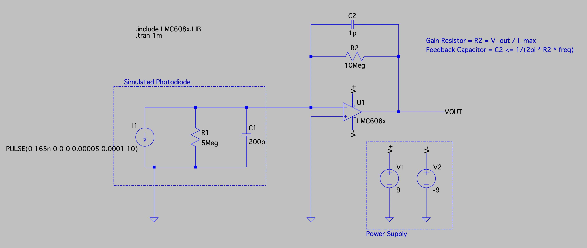

<div align="center">

# nFluora Monitoring Suite

**Real-time NIR fluorescence acquisition and visualization for plant hormone nanosensor research**



</div>

---

## Overview

nFluora is a hardware-software system for detecting gibberellic acid (GA) hormone concentrations in plants using carbon nanotube-based nanosensors. The nanosensors emit near-infrared (NIR) fluorescence at a characteristic wavelength when bound to GA molecules. This repository contains:

- A **transimpedance amplifier (TIA) circuit** designed to convert picoamp-to-nanoamp photodiode currents into measurable voltages
- **Arduino firmware** for analog-to-digital conversion and serial transmission
- **Python monitoring software** providing real-time visualization, baseline calibration, and data recording

## Hardware

### Transimpedance Amplifier Circuit

The TIA converts the photodiode's current output into a voltage suitable for ADC measurement. The design uses the **LMC6081** precision CMOS op-amp, chosen for its ultra-low input bias current (~10fA) which is critical when measuring sub-nanoamp signals.

**Key Components:**

| Component | Value | Purpose |
|-----------|-------|---------|
| R2 (Feedback) | 10 MΩ | Sets transimpedance gain: V_out = I_photodiode × 10 MV/A |
| C2 (Feedback) | 1 pF | Stability compensation, limits bandwidth to ~16 kHz |
| V+/V- | ±9 V | Dual supply for maximum output swing |

**Design Equations:**
- Gain Resistor: `R2 = V_out_max / I_max`
- Feedback Capacitor: `C2 ≤ 1 / (2π × R2 × f_bandwidth)`

The feedback capacitor prevents oscillation by rolling off the gain before the op-amp's phase margin degrades. With a 10 MΩ feedback resistor and 1 pF capacitor, the -3dB bandwidth is approximately 16 kHz—more than sufficient for fluorescence decay signals.

### Photodiode Model

The schematic includes a simulated photodiode with:
- **Shunt resistance:** 5 MΩ (models leakage current)
- **Junction capacitance:** 200 pF (affects high-frequency response)
- **Test signal:** 165 nA pulses at 10 kHz for simulation validation

### Arduino Interface

The Arduino Uno reads the TIA output voltage via its 10-bit ADC (0–5V range, ~4.88 mV resolution) and transmits raw ADC counts over serial at 9600 baud with a 10 ms sampling interval (~100 Hz effective rate).

## Module Structure 

| Module | Description |
|--------|-------------|
| `main.py` | Event loop orchestrating serial reads, calibration, plotting, and command dispatch |
| `cli.py` | Non-blocking command parser using `select()` for stdin polling |
| `calibration.py` | State machine managing baseline acquisition and signal correction |
| `recorder.py` | Thread-safe data recorder with buffered file writes |
| `stats.py` | O(1) running average and median utilities |
| `config.py` | Centralized configuration via environment variables |
| `plot_recorded.py` | Offline visualization of recorded datasets |

## Technical Implementation

### Non-Blocking Standard Input

A key challenge is accepting user commands without blocking the continuous data acquisition loop. The solution uses POSIX `select()` to poll stdin:

```python path=null start=null
while select.select([sys.stdin], [], [], 0)[0]:
    line = sys.stdin.readline()
    # process command...
```

The zero timeout makes `select()` return immediately, allowing the main loop to check for input on every iteration without waiting. This enables responsive CLI interaction during real-time monitoring.

### Multi-Threaded Recording

Recording data to disk during acquisition risks blocking the main loop during file I/O. The `Recorder` class solves this with a producer-consumer pattern:

1. **Main thread** (producer) pushes data strings to a thread-safe `queue.Queue`
2. **Worker thread** (consumer) batches writes and flushes periodically

```python path=null start=null
def _worker(self, path, flush_every=200, flush_interval=0.25):
    buf = []
    with open(path, "w") as f:
        while True:
            item = self.queue.get()
            if item is None:  # Sentinel signals stop
                break
            buf.append(item)
            if len(buf) >= flush_every or time_since_flush >= flush_interval:
                f.writelines(buf)
                buf.clear()
```

This approach minimizes system calls while ensuring data is persisted promptly.

### Signal Processing Pipeline

Raw ADC values pass through a three-stage pipeline:

1. **ADC to Voltage Conversion**
   ```
   V = (ADC_count / 1023) × 5.0V
   ```

2. **Baseline Correction**
   During calibration, the system collects N samples (default: 200) and computes a baseline using either mean or median. Subsequent readings are offset-corrected:
   ```
   V_corrected = V_raw - V_baseline
   ```

3. **Moving Average Smoothing**
   An efficient O(1) running average maintains a sliding window sum:
   ```python path=null start=null
   def add(self, value):
       if len(self.buffer) == self.k:
           self.running_sum -= self.buffer[0]  # Remove oldest
       self.buffer.append(value)
       self.running_sum += value
   
   def get(self):
       return self.running_sum / len(self.buffer)
   ```
   This avoids O(k) summation on every sample.

### Real-Time Visualization

Matplotlib runs in interactive mode (`plt.ion()`) with selective updates to maintain responsiveness:

- Plot data is stored in fixed-size `deque` buffers (default: 100 samples)
- The display refreshes every N samples (default: 5) rather than on every data point
- `ax.relim()` and `ax.autoscale_view()` dynamically adjust axis bounds

## Installation

### Prerequisites

- Python 3.10+
- `arduino-cli` (for firmware upload)
- Arduino Uno (or compatible board)

### Setup

1. **Create and activate a virtual environment:**
   ```bash
   python3 -m venv venv
   source venv/bin/activate
   ```

2. **Install Python dependencies:**
   ```bash
   pip install pyserial matplotlib timelength
   ```

3. **Compile and upload the Arduino sketch:**
   ```bash
   make all
   ```
   This compiles the sketch and uploads it to the default port (`/dev/cu.usbmodem1201`). Edit the `Makefile` to change the port.

## Usage

### Starting the Monitor

```bash
make monitor
```

Or manually:

```bash
PORT=/dev/cu.usbmodem1201 BAUDRATE=9600 python3 main.py
```

### CLI Commands

| Command | Description |
|---------|-------------|
| `help` | Display available commands |
| `calibrate` | Begin baseline calibration (do not apply signal during this phase) |
| `record <duration> <filename>` | Record data for the specified duration (e.g., `record 30s data.dat`) |
| `exit` | Close the application |

### Recording Data

After calibration, record a session:

```
record 10s experiment_001.dat
```

Duration supports flexible formats: `30s`, `1m30s`, `2m`, etc.

### Plotting Recorded Data

```bash
python3 plot_recorded.py experiment_001.dat
```

### Data Format

Recorded files are CSV with four columns:

```
timestamp,raw_voltage,corrected_voltage,smoothed_voltage
0.0,1.075,0.004,0.052
0.01,3.949,2.878,0.115
...
```

## Configuration

Edit `config.py` or modify the `Config` dataclass instantiation in `main.py`:

| Parameter | Default | Description |
|-----------|---------|-------------|
| `baseline_samples` | 200 | Samples collected during calibration |
| `plot_window` | 100 | Number of samples visible in the plot |
| `moving_avg_k` | 50 | Smoothing window size |
| `use_median_baseline` | False | Use median instead of mean for baseline |
| `plot_update_interval` | 5 | Refresh plot every N samples |
| `fullscreen` | False | Launch plot in fullscreen mode |

## License

This project was developed as a fourth-year capstone design project. All Rights Reserved. Copyright 2026 by the nFluora Team.
